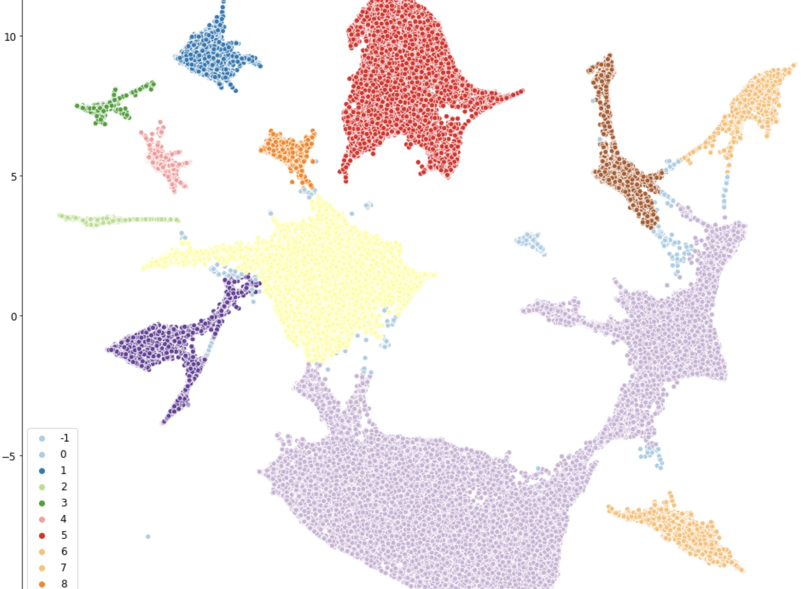
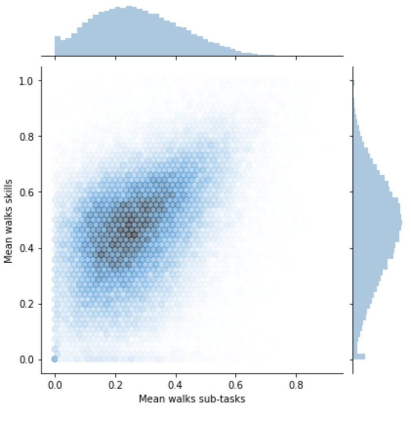
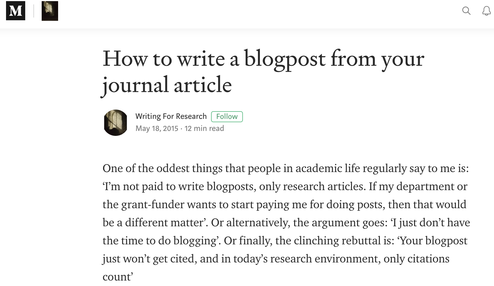

<!---->

# <!--fit--> Technological knowledge, skills and competences
for employability of PhDs 
(outside academia)
IETN meeting 14/11 - 2019 

###### Roman Jurowetzki, roman@business.aau.dk
---

---

Actually, that are extremely useful methods for research

---

---

---
# A bit about me
- I never worked outside this university :sunglasses:
- PhD 2016
- Technological change vs Computational Methods in SocSci
- [Social Data Science](https://sds.aau.dk)
- [PhD Course](https://caldiss-aau.github.io/sdsphd19/) coming up
- [Corporate Training - SDC](https://kina.um.dk/en/the-trade-council/innovation-center/iblog/newsdisplaypage/?newsID=2802FA46-4A4F-4D43-9601-1C12CB8EC3A7)
- Guest editor - SI Scientometrics on AI&ML for Ecosystem Mapping. Pub. end 2020
---

# <!--fit--> Is it another talk about methods?
---

# <!--fit--> Is it another talk about methods?
# <!--fit--> Kind of :innocent:

---
# When I started with tech skills

- Frustration about approaches and data in my field
- Natural Language Processing
- The openness of my supervisor
- Structuring of unstructured data $\rightarrow$ tapping into "BigData"

---
# What else? 
#### "Computational Thinking" - for the lack of a better term

- Working with networks
- Working with strange data
- Working with large data
- Coding skills

---
# I'm still in academia
## But our students get into really nice projects with companies

- SparNord: Customer Churn / Lifetime Value
- QAgentur: NLP work in marketing - cosmetics
- Telenord: Employe performance / Turnover
- Gym: Customer engagement

Skills in demand

---

# <!--fit--> But where should I start?

---
# Small steps - engaging with technology

- Drop Word, use [LaTeX](https://www.overleaf.com/) (the initial frustration pays off)
- Try out a [bibliometric analysis](https://www.vosviewer.com/) of your research field 

---

# More specific suggestions

   

- Pick up an SSG (static site generator) and make a website for yourself.
- You can do that in [1 hour and host it for free on GitHub](https://inside.getambassador.com/creating-and-deploying-your-first-hugo-site-to-github-pages-1e1f496cf88d) or Netlify
- You will learn GitHub, some frontend, markdown

---
<!---->
<!---->
# Stats./Econometrics 
### - A Discipline of Fear -
- People that know least pretend they actually do rocket science :rocket:
- You are not building a microwave, you are just trying to make food :yum:
- Also: Most good resources are free - and YouTube is sometimes better than things you find in an "academic" publication (use your intuition)

---

# How to get started contd.?
- Take the approach that supports your way of thinking (for me it was language)
- Don't be afraid to experiment (and fail)
- Learn code (drop Excel & co.) - Reproducible pipelines

---

## Data-Driven Decisionmaking

- Try to get an idea of predictive modelling
- Unsupervised / Supervised Machine Learning
- Role of data in organizations
- [Industry Podcasts](https://twimlai.com/) can be useful

---

## Get better at basic data-munging
- Data cleaning
- Subsetting/filtering
- Aggregation
- Merging
- [Datacamp](https://www.datacamp.com/) is a great ressource here 

---

## Look into writing practice and dissemination

- ‘Your blogpost just won’t get cited, and in today’s research environment, only citations count’
- ‘I’m not paid to write blog posts, only research articles.'

[why and how you should do it anyway](https://medium.com/advice-and-help-in-authoring-a-phd-or-non-fiction/how-to-write-a-blogpost-from-your-journal-article-6511a3837caa)

---

---

### <!--fit--> :ok_hand:

